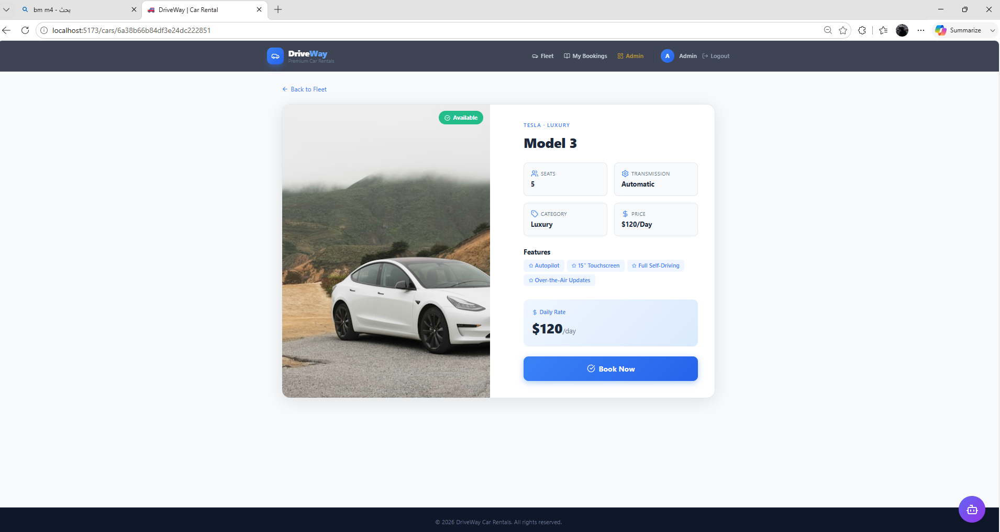
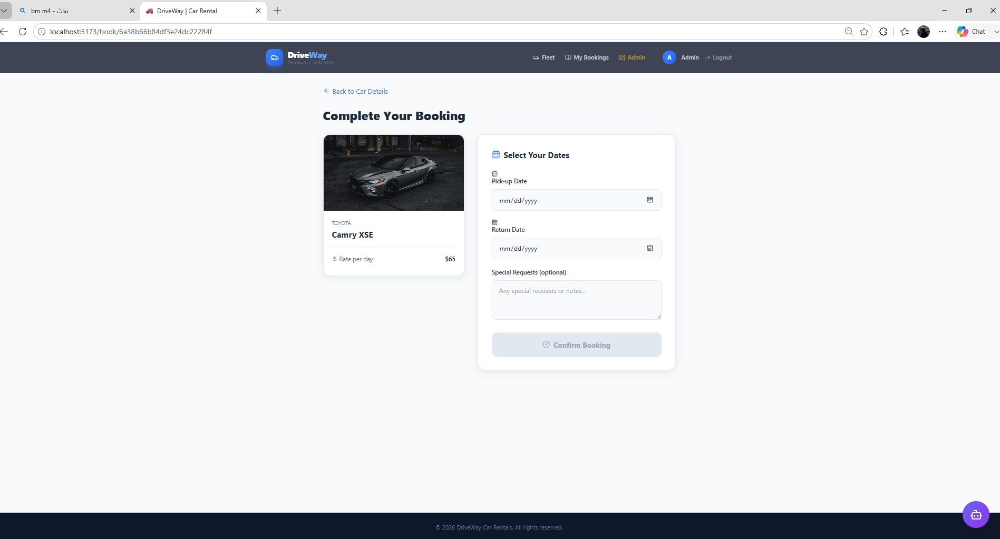
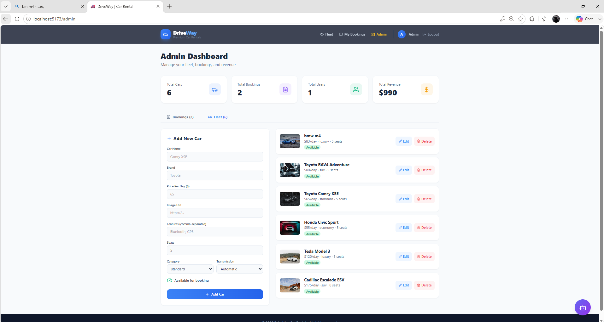
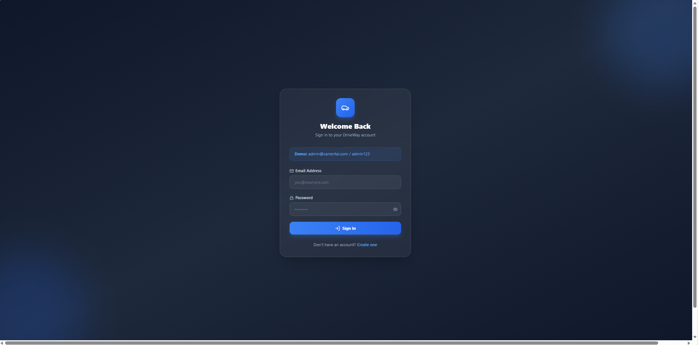
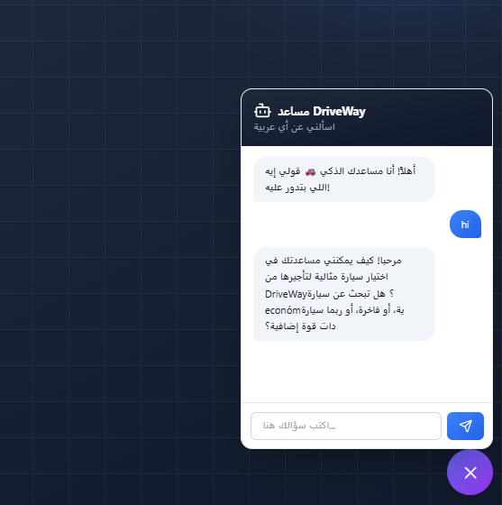

# DriveWay — Full-Stack Car Rental Booking Platform

<p align="center">

A modern full-stack car rental booking platform built with **React**, **Node.js**, **Express**, and **MongoDB**.

Designed with scalability, security, and maintainability in mind while following modern full-stack development best practices.

</p>

---

## 📖 Overview

DriveWay is a production-ready car rental management platform that allows users to browse available vehicles, reserve cars, manage bookings, and securely authenticate using JWT.

The platform also includes an admin dashboard for managing cars, users, and reservations while providing system-wide statistics.

---

# ✨ Features

## 👤 Authentication

* User Registration
* Secure Login
* JWT Authentication
* Email Verification
* Protected Routes
* Persistent Authentication
* Role-Based Authorization (User / Admin)

---

## 🚗 Car Management

* Browse Available Cars
* Search Cars
* Filter by Category
* Car Details Page
* Availability Status
* Dynamic Pricing
* Admin CRUD Operations

---

## 📅 Booking System

* Book Available Cars
* Automatic Total Price Calculation
* Prevent Double Booking
* Booking History
* Booking Status Updates
* Booking Cancellation

---

## 📊 Admin Dashboard

* Manage Cars
* Manage Bookings
* View Statistics
* Revenue Tracking
* User Management
* Booking Monitoring

---

## 🤖 Additional Features

* Responsive Design
* REST API
* Chatbot Integration
* Global Error Handling
* Secure Password Hashing
* Input Validation
* Axios Interceptors
* Authentication Persistence

---

# 🛠 Tech Stack

## Frontend

* React
* Vite
* React Router DOM
* Axios
* Context API
* CSS

---

## Backend

* Node.js
* Express.js
* MongoDB
* Mongoose
* JWT
* bcrypt
* Express Validator

---

## Development Tools

* Git
* GitHub
* Postman
* VS Code

---

# 🏗 System Architecture

```text
                     React Frontend
                           │
                           │ HTTP Requests
                           ▼
                    Express REST API
                           │
        ┌──────────────────┴──────────────────┐
        │                                     │
 Authentication                      Booking Logic
        │                                     │
        └──────────────────┬──────────────────┘
                           │
                      MongoDB Database
```

---

# 📂 Project Structure

```text
DriveWay
│
├── backend
│   ├── config
│   ├── controllers
│   ├── middleware
│   ├── models
│   ├── routes
│   ├── utils
│   ├── server.js
│   └── package.json
│
├── frontend
│   ├── public
│   ├── src
│   │   ├── components
│   │   ├── pages
│   │   ├── services
│   │   ├── context
│   │   ├── layouts
│   │   └── hooks
│   ├── package.json
│   └── vite.config.js
│
└── README.md
```

---

# 🔒 Authentication Flow

```text
User Login
     │
     ▼
JWT Token Generated
     │
     ▼
Stored in Local Storage
     │
     ▼
Axios Automatically Sends Token
     │
     ▼
Protected Backend Routes
```

---

# 🚀 Getting Started

## Clone Repository

```bash
git clone https://github.com/mohamednasserdev/driveway.git

cd driveway
```

---

# Backend Setup

```bash
cd backend

npm install
```

Create `.env`

```env
PORT=5000

MONGO_URI=YOUR_MONGODB_URI

JWT_SECRET=YOUR_SECRET_KEY

JWT_EXPIRES_IN=7d

CLIENT_URL=http://localhost:5173

NODE_ENV=development
```

Run Backend

```bash
npm run dev
```

---

# Frontend Setup

```bash
cd frontend

npm install

npm run dev
```

---

# 🌍 Environment Variables

## Backend

| Variable       | Description        |
| -------------- | ------------------ |
| PORT           | Server Port        |
| MONGO_URI      | MongoDB Connection |
| JWT_SECRET     | JWT Secret         |
| JWT_EXPIRES_IN | Token Expiration   |
| CLIENT_URL     | Frontend URL       |
| NODE_ENV       | Environment        |

---

## Frontend

```env
VITE_API_URL=http://localhost:5000/api
```

---

# 📡 REST API

## Authentication

| Method | Endpoint           |
| ------ | ------------------ |
| POST   | /api/auth/register |
| POST   | /api/auth/login    |
| GET    | /api/auth/me       |

---

## Cars

| Method | Endpoint      |
| ------ | ------------- |
| GET    | /api/cars     |
| GET    | /api/cars/:id |
| POST   | /api/cars     |
| PUT    | /api/cars/:id |
| DELETE | /api/cars/:id |

---

## Bookings

| Method | Endpoint                 |
| ------ | ------------------------ |
| POST   | /api/bookings            |
| GET    | /api/bookings/my         |
| GET    | /api/bookings            |
| PATCH  | /api/bookings/:id/status |

---

# 🛡 Security

* JWT Authentication
* Password Hashing (bcrypt)
* Authorization Middleware
* Role-Based Access Control
* Express Validator
* Environment Variables
* Global Error Handler
* Duplicate Booking Prevention
* MongoDB Validation

---

# ⚡ Performance

* Modular Folder Structure
* Axios Interceptors
* Optimized MongoDB Queries
* Compound Indexes
* Reusable Components
* Clean Architecture

---

# 🚀 Deployment

Frontend

* Vercel

Backend

* Render

Database

* MongoDB Atlas

---

# 📸 Screenshots

### Home Page


---

### Car Details



---

### Booking



---

### Admin Dashboard



---

### Login



---

### Chatbot



---

# 📌 Future Improvements

* Online Payments (Stripe)
* Google Maps Integration
* Cloudinary Image Upload
* Email Notifications
* Wishlist
* Reviews & Ratings
* Multi-language Support
* Dark Mode
* Real-time Notifications
* Docker Deployment

---

# 👨‍💻 Author

**Mohamed Nasser**

GitHub

https://github.com/mohamednasserdev

LinkedIn

https://www.linkedin.com/in/mohamed-nasser-dev

---

# ⭐ Show Your Support

If you like this project, please consider giving it a ⭐ on GitHub.

It really helps and motivates future improvements.

---

<p align="center">

Made with ❤️ by Mohamed Nasser

</p>
